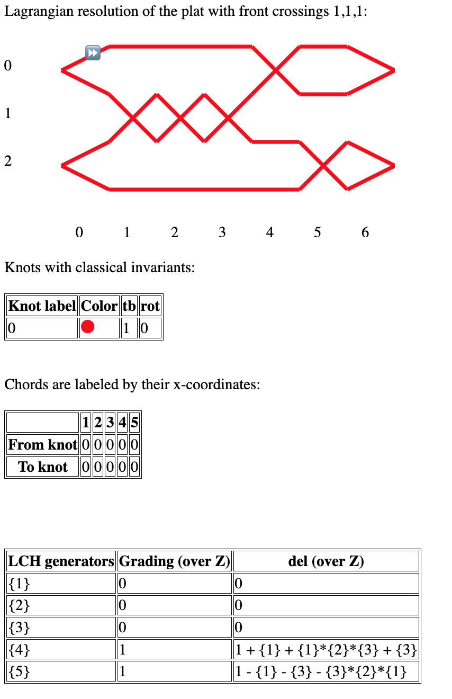
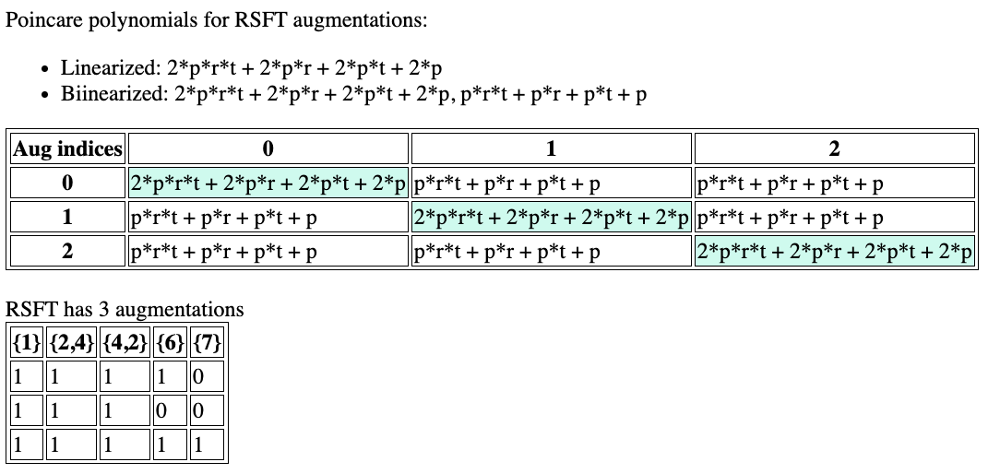

# Legendrian links

An interactive application for analyzing Legendrian links. This project is currently under active development.

The program focuses on enumerations of augmentations and computation of bilinearized homologies of LCH algebras and [planar diagram algebras (PDA)](https://arxiv.org/abs/2205.13031).  It uses plat diagrams to represent Legendrians in R3. Plats make [holomorphic disks particularly nice](https://arxiv.org/abs/2104.00505) (helping with algorithmic computation), although putting a Legendrian in plat position will typically introduce many extra crossings. Analysis of links is accessible through a web application (with minimal dependencies) for easy visual inspection of link diagrams. This means you don't need to know how to code to analyze basic examples.

Much of this recreates [Sivek's lch.sage](https://www.ma.imperial.ac.uk/~ssivek/code/lch.sage) so that it will be applicable to PDA and be able to handle heavy computations. We've also benefited from studying code written by Josh Sabloff and collaborators which extends [gridlink](https://github.com/3-manifolds/gridlink). The most developed parts of this software are performance optimized algorithms for enumerating points in varieties over finite fields (see `main/polynomials.py`) and algorithmic computations of spectral sequence Betti numbers (see `main/algebra.py`). For an explanation of the latter, see [this note](https://drive.google.com/file/d/1BmXbRcE-ZUWhSj6n8E_wcMgKTp2UKWvf/view?usp=sharing).

# Installation

To install and run the server from your terminal from the root of the project:

```
$ python3 -m pip install pipenv
$ python3 -m pipenv install
$ python3 -m pipenv shell
$ cd main
$ python app.py
```

You may need to modify the version of python in Pipfile so that this is compatible with your system.

# Web interface

When you run `app.py` as above, a URL should appear which you can access from your web browser. Parameters `n_strands` and `crossings` (indicating front crossings) can be added. The `crossings` parameter gives a plat presentation of the link in the front projection, with crossing indices ranging from 0 to `n_strands` - 2, ordered from left to right.

Here is a screenshot for `http://127.0.0.1:5000/?n_strands=4&crossings=1,1,1&lch_signs=True` which computes the LCH algebra of the trefoil over the integers. Our convention for signs is given by Figure 4 of [Etnyre and Ng's survey](https://arxiv.org/abs/1811.10966).



Here is a screenshot for `http://127.0.0.1:5000/?n_strands=6&crossings=3,1,2,2,1,3,3&auto_dgas=rsft`, giving a [polyfillable link](https://arxiv.org/abs/1307.7998):


Here is a complete list of url arguments:
- `n_strands`: How many strands of the plat? Must be a positive even integer.
- `crossings`: Crossings of the plat in the front projection. This will be resolved using Lagrangian resolution.
- `mirror`: If True, reverse order of the the front_crossings.
- `n_copy`: If provided with an integer, will make an n-copy diagram.
- `orientation_flips`: Comma separated list of True/False. Will change the orientations of the link components.
- `lch_signs`: If True, compute LCH DGA over the integers. Only differentials will be displayed and the remaining flags will be ignored. 
- `auto_dgas`: `lch`, `rsft`, or both (`lch,rsft`). Which DGAs should we analyze? Here `rsft` is the planar diagram algebra.
- `aug_fill_na`: 0 or 1 if used. Use only is there are many augmentations. Augmentations will always be computed with some variables set to `None` (meaning that they could take on any value, 0 or 1). If `aug_fill_na` is not None, we use this number to fill in these values.
- `spec_poly`: If True and `auto_dgas=rsft`, will compute the spectral sequence polynomials associated to bilinearizations as described in [the article](https://arxiv.org/abs/2205.13031).

If we modify the above URL to `http://127.0.0.1:5000/?n_strands=6&crossings=3,1,2,2,1,3,3&auto_dgas=rsft&spec_poly=True`, we'll see the collections of Poincaré polynomials from the above screenshot modified:



When using the planar diagram algebra (`rsft` as in the above example), we always use the partition fully separates the link. Generators are words of chords written `{x_1,...,x_n}` where the `x_i` are the `x` coordinates of the chords in the diagram. In this case, we use `Z` gradings by default if the rotation numbers of the components of the link are all 0.

Only use the web interface to compute augmentations for links with small numbers of crossings (say, < 30). You can monitor the terminal to see what computations are happening. For small numbers of crossings, computations of bilinearized Poincare polynomials may still take a while. Typically things will take a long time if there are many augmentations, which can be seen in the terminal logs.

To visualize a plat diagram without computing any holomorphic disks, omit the `auto_dgas` flag. For example `http://127.0.0.1:5000/?n_strands=6&crossings=3,1,2,2,1,3,3&lazy_disks=True`. You can visualize links of any size without putting much strain on your computer.

# Python interface

Computing augmentations of DGAs with large numbers of generators can take hours or be impossible due to memory constraints. Even computing gradings for DGAs can be time consuming.

Run the following code from inside the `main/` folder to setup the `PlatDiagram` object for a (5, 2) knot:
```
$ python
>>> import legendrian_links as ll
>>> front = [1 for _ in range(5)]
>>> pd = ll.PlatDiagram(n_strands=4, front_crossings=front, n_copy=2, lazy_disks=False, lazy_lch=True, lazy_rsft=True)
>>> pd.set_lch(lazy_augs=True, lazy_bilin=True)
>>> pd.lch_dga.set_augmentations()
>>> pd.lch_dga.set_all_bilin()
```
The `lazy...` options can prevent the kick-off of some potentially heavy computations. All of the URL arguments have counterparts for the python interface's initialization of `ll.PlatDiagram`. We'll improve documentation at some point, but for now, check out the code. Some experimental options for `set_augmentations` are trying to help speed up computations (see the code). We can also fun the above with less commands:
```
$ python
>>> import legendrian_links as ll
>>> front = [1 for _ in range(5)]
>>> pd = ll.PlatDiagram(n_strands=4, front_crossings=front, n_copy=2, lazy_disks=False, lazy_lch=False, lazy_rsft=True)
```

It can take a long time to compute augmentations and bilinearized homologies of DGAs. To store a DGA for later analysis, we use the `pickle` functions. Here is an example which assumes we have `pd` as above:
```
>>> lch = pd.lch_dga
>>> lch.pickle('my_favorite_dga.pk')
```
Now we can reload the dga with all of its computed data in a new session:
```
$ python
>>> import legendrian_links as ll
>>> lch = ll.DGA.from_pickle('my_favorite_dga.pk')
>>> lch.augmentations
... will show list of all augs ...
```
The pickle functionality only stores the data of a DGA, so that we can recover old DGAs even after our code has been updated.

It's often the case that the number of augmentations is too large to be stored in memory by any computer (eg. 2**100). If the number of augmentations is very large, they can still be computed and stored using "compressed representations". In the following example, we'll see that there are a small number of augmentations, meaning it is ok to "decompress" them to usual augmentations.
```
$ python
>>> import legendrian_links as ll
>>> front = [1 for _ in range(5)]
>>> pd = ll.PlatDiagram(n_strands=4, front_crossings=front, n_copy=1, lazy_disks=False, lazy_lch=True, lazy_rsft=True)
>>> pd.set_lch(lazy_augs=True, lazy_bilin=True)
>>> pd.lch_dga.set_augmentations(decompress=False)
2022-03-16 10:09:56,784|utils|INFO|Starting execution set_augmentations
...
2022-03-16 10:11:02,702|utils|INFO|Found 8 compressed augmentations of DGA
2022-03-16 10:11:02,702|utils|INFO|Found 21 (uncompressed) augmentations of DGA
2022-03-16 10:11:02,702|utils|INFO|Ending execution set_augmentations
>>> pd.lch_dga.decompress_augmentations()
```
Now we can proceed with computing bilinearized homologies, etc. If the number of augmentations is very large, we can select subsets of the augmentations using the `fill_na` option:
```
>>> pd.lch_dga.decompress_augmentations(fill_na=0)
```

# Poincare polynomials

The classes `ChainComplex`, `MatrixChainComplex`, and `SpectralSequence` all have `poincare_polynomial()` methods. The `DGA` class can use these to compute polynomials associated to (bi)linearized homologies. Our convention for polynomials of a chain complex yield
```latex
P(t) = \sum dim(H_{k})t^{k}.
```
For a spectral sequence, we set
```latex
P^{spec}(r, p, t) = \sum dim(E^{page}_{filt, deg})r^{page - 1}p^{filt}t^{deg}
```
where `page >= 1` is the page number, `filt` is the filtration degree of variables, and `deg` is the homological degree. Note that this convention does not agree with the Leray-Serre convention. In particular, differentials go
```latex
E^{page}_{filt, deg} --> E^{page}_{filt - page + 1, deg-1}. 
```

The `SpectralSequence` class is available for filtered, Z-graded chain complexes (meaning `grading_mod = 0`). In the following example, we compute the spectral sequence for the Morse homology of a heart-shaped sphere. The dots are critical points and the thin lines are Morse trajectories.


```python
import sympy
import algebra

w, x, y, z = sympy.symbols('w,x,y,z')
gradings = {w: 2, x: 2, y: 1, z: 0}
differentials = {
    w: algebra.Differential(y, coeff_mod=2),
    x: algebra.Differential(y, coeff_mod=2),
    y: algebra.Differential(0, coeff_mod=2),
    z: algebra.Differential(0, coeff_mod=2)}
filtration_levels = {w: 4, x: 3, y: 2, z: 1}
specseq = algebra.SpectralSequence(
    gradings=gradings, differentials=differentials, filtration_levels=filtration_levels, coeff_mod=2)
p_poly = specseq.poincare_poly()
```
The result we get can be verified by hand:
```python
p_poly = p + (t * p**2) + (p**3 + p**4)*t**2 + (r + r**2 + r**3)*(p + (p**4)*(t**2)
```

# Testing

To run tests, navigate to the `main` folder and run `test_main.py` inside of the pipenv shell:
```
$ pwd
.../legendrian_links/main
$ python test_main.py
```
Tests should be added for any new features. It is also helpful to use the web application to check examples during development. When bugs are discovered, it is best to add new tests. In the least, new exception handling should be added which spots the issue.

# Technical notes

## Threading and Groebner bases

Groebner basis computations used to search for augmentations can be very heavy and they are skipped if they take too long. This timeout functionality is very difficult to implement when using the web app (for threading reasons). In general, Groebner computations will be skipped whenever `pd.rsft_dga.set_augmentations(...)` or `polynomials.zero_set(...)` are called outside of the main thread.

## Recursion limits

We use [sympy](https://www.sympy.org/en/index.html) to encode and manipulate polynomials. The functionality for performing variable substitutions in `sympy` relies on a [recursive method](https://github.com/sympy/sympy/blob/master/sympy/polys/densebasic.py#L452) which we've seen exceed python's [default recursion depth limit](https://stackoverflow.com/questions/3323001/what-is-the-maximum-recursion-depth-in-python-and-how-to-increase-it) for polynomials in ~300 variables. The error message looks like
```
  File ".../lib/python3.6/site-packages/sympy/polys/densebasic.py", line 474, in dmp_to_tuple
    return tuple(dmp_to_tuple(c, v) for c in f)
  File ".../lib/python3.6/site-packages/sympy/polys/densebasic.py", line 474, in <genexpr>
    return tuple(dmp_to_tuple(c, v) for c in f)
  File ".../lib/python3.6/site-packages/sympy/polys/densebasic.py", line 474, in dmp_to_tuple
    return tuple(dmp_to_tuple(c, v) for c in f)
  File ".../lib/python3.6/site-packages/sympy/polys/densebasic.py", line 474, in <genexpr>
    return tuple(dmp_to_tuple(c, v) for c in f)
RecursionError: maximum recursion depth exceeded
```
To manually override this, add the following lines to your code:
```
import sys
sys.setrecursionlimit(10000)
```
I cannot guarantee that this is not a bad idea!

# To do list

## Features

- Capping paths is storing too much info. We really only need this for rotation numbers.
- Ability to import as a library (eg. for use in Jupyter).
- Normalized euler characteristic and normalized augmentation count.
- Compute the full augmentation tree?
- Tools for decompressing augmentations. We want to control the order of augmentations so that we can track them by indices.
- How do we more efficiently store augmentations? Maybe as `SubsNode`s? Currently it appears that compressed augs can expand enormously.
- Command line interface would make it easy to run scripts.
- Is there any way to speed up the computations of poincare polynomials? This should boil down to speeding up `rref` computations.
- Grid -> plat algorithm. From grids could import the knot atlas or do algorithmic exploration. Difficult to enumerate links using plat presentations.
- Copy knot tables.
- UI: Ordering of generators is annoyingly out of place. Should also count numbers of augs.
- Check if two augmentations are homotopic or not, by seeing if the bilinearized homology has non-zero hom to the base field.
- Make tables nicer using some JS library. Big tables can be condensed. It would also be nice to sort data.
- Introduce t coordinate in differentials. (This is not so important for augmentations where we can use t=1 for Z/2Z coeffs).
- Orientations: Process disks into differentials for LCH with Z coefficients.
- Carry out orientation processing for RSFT differentials. This requires theoretical work.
- Algorithmically determine a plat diagram from a grid diagram.
- Compute differentials for 2-copies and twisted 2-copies.
- In the we interface, users can do basic input links, flip components, etc with HTML / javascript input.

## Cleanup, performance, and testing

- Tests for different modules should have their own files in a `test/` directory.
- `algebra.py` is too big and should be broken up into its own module with separate files.
- dga.py test cases needed for more polynomials.
- dga.py needs tests for differentials and DGA class methods.
- Add pylint or something to ensure code cleanliness.
- Review relationships between data structures.

## Data sets

- Port knots from the Legendrian knot atlas or other resource into `links.json`.
- Get two component links from the link atlas.
