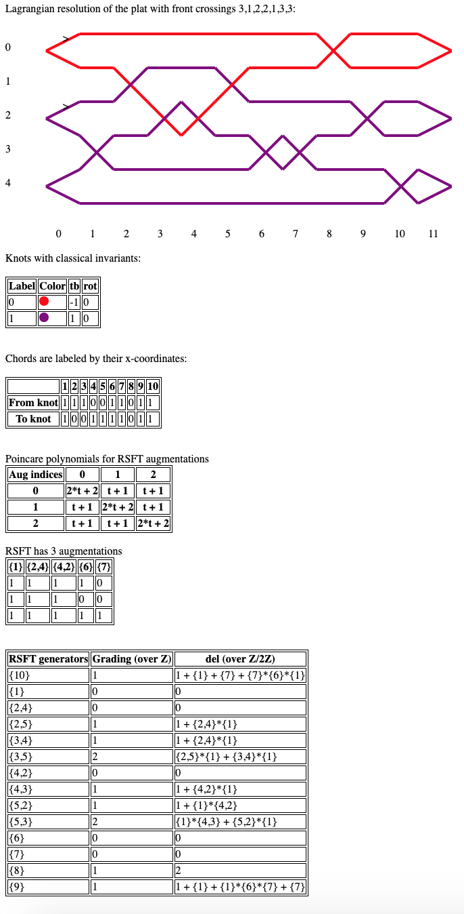

# Legendrian links

An interactive application for analyzing Legendrian links. Or it will be some day, maybe.

Much of this recreates [Sivek's lch.sage](https://www.ma.imperial.ac.uk/~ssivek/code/lch.sage) so that it will be applicable to generalizations of the LCH algebra. We also want to make analysis of knots accessible through a web application (with minimal dependencies) so that users don't need to know how to code.

# Installation

To install and run the server from your terminal from the root of the project:

```
python3 -m pip install pipenv
pipenv install
pipenv shell
cd main
python app.py
```

A URL should appear which you can access from your web browser. Parameters `n_strands` and `crossings` (indicating front crossings) can be added. Here is a screenshot for `http://127.0.0.1:5000/?n_strands=6&crossings=3,1,2,2,1,3,3`, giving a [polyfillable link](https://arxiv.org/abs/1307.7998):



# To do list

## Features

- Is there any way to speed up the computations of poincare polynomials? This should boil down to speeding up `rref` computations.
- Copy knot tables.
- UI: Ordering of generators is annoyingly out of place. Should also count numbers of augs.
- Check if two augmentations are homotopic or not, by seeing if the bilinearized homology has non-zero hom to the base field.
- Should be able to use Groebner bases to tell if the commutative version of a DGA is trivial with Z/2 ceoffs. Implement in dga.py.
- Make tables nicer using some JS library. Big tables can be condensed.
- Introduce t coordinate in differentials. (This is not so important for augmentations where we can use t=1 for Z/2Z coeffs).
- Ability to flip orientations of link components.
- Ability to reverse orientations on link components.
- Orientations: Process disks into differentials for LCH with Z coefficients.
- Carry out orientation processing for RSFT differentials.
- Algorithmically determine a plat diagram from a grid diagram.
- Compute differentials for 2-copies and twisted 2-copies.
- In the we interface, users can do basic input links, flip components, etc with HTML / javascript input.

## Cleanup, performance, and testing

- Tests for different modules should have their own files.
- More test cases for matrices.
- dga.py test cases needed for more polynomials.
- dga.py needs tests for differentials and DGA class methods.
- Add pylint or something to ensure code cleanliness.
- Review relationships between data structures.
- Make `legendrian_links` importable as a python library.

## Data sets

- Port knots from the Legendrian knot atlas or other resource into `links.json`.
- Get two component links from the link atlas.
